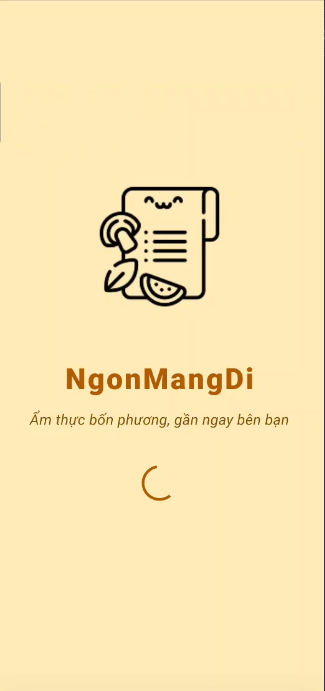
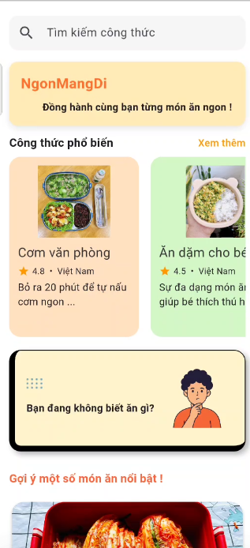
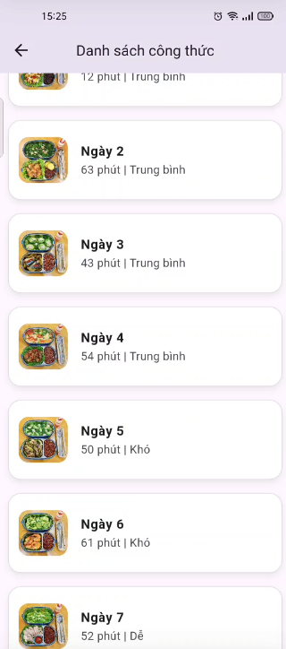
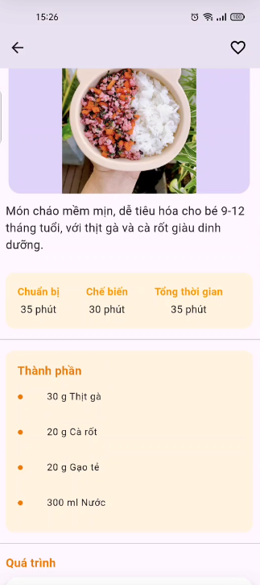
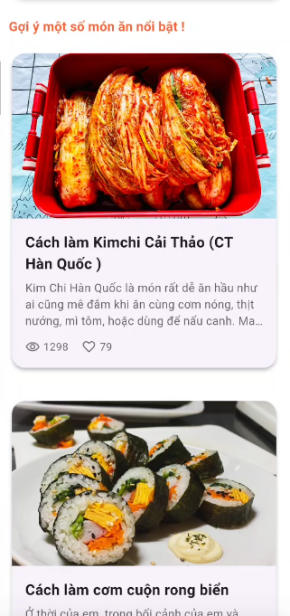
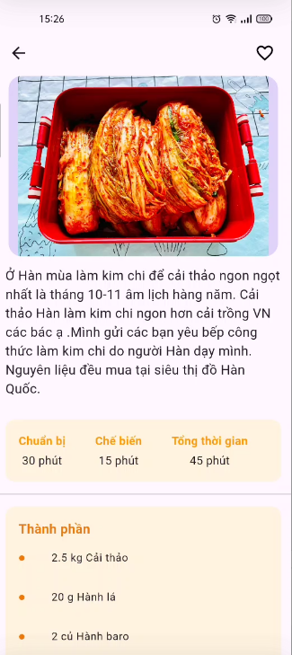
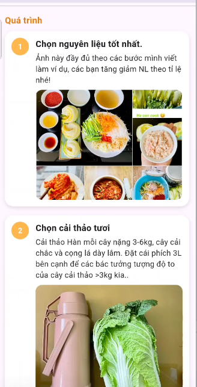
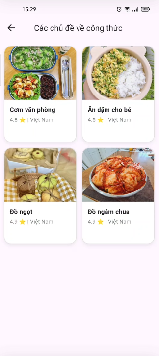
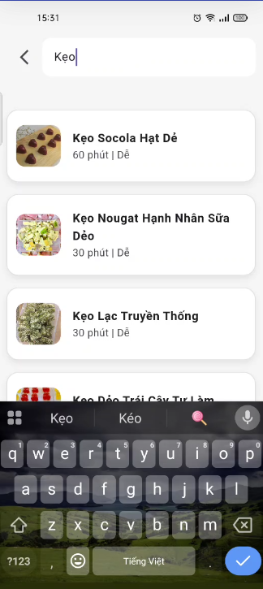

# 🍳 Ngon Mạng Đi - Ứng Dụng Công Thức Nấu Ăn

<div align="center">
  
  
  [](https://flutter.dev)
  [](https://firebase.google.com)
  [](LICENSE)
  [](https://play.google.com/store/apps/details?id=com.example.ngon_mang_di)
</div>
## ✨ Features

<p align="center" style="display: flex; flex-wrap: wrap; justify-content: center; gap: 20px; padding: 20px; background-color: #f8f9fa; border-radius: 10px; margin: 20px 0;">
  
  
  
  
  
  
  
  
  
</p>


## 📱 Giới Thiệu

Ngon Mạng Đi là ứng dụng di động giúp người dùng khám phá và chia sẻ các công thức nấu ăn ngon. Ứng dụng được xây dựng bằng Flutter và tích hợp với Firebase để mang đến trải nghiệm mượt mà và đáng tin cậy.

## ✨ Tính Năng Chính

- 🔍 **Khám Phá Công Thức**: Tìm kiếm và duyệt qua hàng ngàn công thức nấu ăn
- 📱 **Giao Diện Đẹp**: Thiết kế hiện đại, thân thiện với người dùng
- 🔔 **Thông Báo**: Nhận thông báo về công thức mới và cập nhật
- 📱 **Đa Nền Tảng**: Hoạt động trên cả Android và iOS
- 🌐 **Kết Nối**: Chia sẻ công thức với bạn bè và cộng đồng

## 🛠 Công Nghệ Sử Dụng

- **Frontend**: Flutter
- **Notifications**: Firebase Cloud Messaging

## 🚀 Bắt Đầu

### Yêu Cầu Hệ Thống

- Flutter SDK 3.7.0 trở lên
- Dart SDK 3.0.0 trở lên
- Android Studio / VS Code
- Firebase CLI

### Cài Đặt

1. Clone repository:
```bash
git clone https://github.com/your-username/ngon_mang_di.git
```

2. Di chuyển vào thư mục dự án:
```bash
cd ngon_mang_di
```

3. Cài đặt dependencies:
```bash
flutter pub get
```

4. Cấu hình Firebase:
   - Tạo project trên Firebase Console
   - Tải file `google-services.json` và đặt vào `android/app/`
   - Cấu hình Firebase trong dự án

5. Chạy ứng dụng:
```bash
flutter run
```

## 📱 Tính Năng Thông Báo

Ứng dụng sử dụng Firebase Cloud Messaging để gửi thông báo đến người dùng:

- Thông báo về công thức mới
- Cập nhật về công thức yêu thích
- Thông báo tương tác từ cộng đồng

## 🎨 Giao Diện

Ứng dụng có giao diện người dùng hiện đại và thân thiện:

- Thiết kế Material Design
- Hỗ trợ chế độ tối/sáng
- Responsive trên mọi kích thước màn hình

## 📱 Tải Ứng Dụng

Bạn có thể tải ứng dụng Ngon Mạng Đi từ Google Play Store:

[](https://play.google.com/store/apps/details?id=com.example.ngon_mang_di)

## 🤝 Đóng Góp

Chúng tôi rất hoan nghênh mọi đóng góp! Hãy tạo pull request hoặc issue để đóng góp cho dự án.

## 📄 Giấy Phép

Dự án này được cấp phép theo giấy phép MIT - xem file [LICENSE](LICENSE) để biết thêm chi tiết.

## 📞 Liên Hệ

- Email: nguyenthanhtrungtt20@gmail.com
- Facebook: [Ngon Mạng Đi](https://facebook.com/ngonmangdi)

---

<div align="center">
  Made with ❤️ by TrungNguyen
</div>